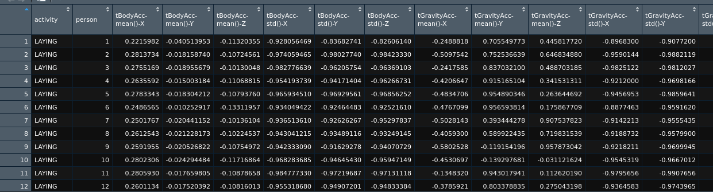

# Data Collection

## Origin
All datas came from the Folder UCI-HAR-Dataset.

## Algorithm
The algorithm to create the Dataset provided in this project was created by an R script, and doing the following steps:
* Catch all name labels
* Catch all datas and associate with name labels previously captured
* In the dataset originated from X_(test|train).txt capture only the columns with "std" or "mean" in its column name (transformed_x)
* Transform all data that came from y_(test|train).txt into descriptive values according to the values in activity_label.txt (transformed_y)
* create a new column called status = test or train, wich value is based on the folder it is running (new_status)
* bind all transformed data by columns with bind_cols R function (transformed_y, transformed_x, new_status)

The steps above was runned twice, one for "test" folder and another for "train" folder, the data was merged, with bind_rows R function, and it was ready to be grouped by activity and was removed the status column (wich is not a numeric value), after that the *mean* according to activity was calculated and ready to be show.

Example:

## Variables

The table below will give you a resume at all variables available.

| Variable Name | Explanation | Values |
|:----------:|:-------------:|:------:|
| activity | activity where mean values were captured | LAYING, SITTING, STANDING, WALKING, WALKING_DOWNSTAIRS, WALKING_UPSTAIRS |
| tBodyAcc-mean()-X | | |
| tBodyAcc-mean()-Y | | |
| tBodyAcc-mean()-Z | | |
| tBodyAcc-std()-X | | |
| tBodyAcc-std()-Y | | |
| tBodyAcc-std()-Z | | |
| tGravityAcc-mean()-X | | |
| tGravityAcc-mean()-Y | | |
| tGravityAcc-mean()-Z | | |
| tGravityAcc-std()-X | | |
| tGravityAcc-std()-Y | | |
| tGravityAcc-std()-Z | | |
| tBodyAccJerk-mean()-X | | |
| tBodyAccJerk-mean()-Y | | |
| tBodyAccJerk-mean()-Z | | |
| tBodyAccJerk-std()-X | | |
| tBodyAccJerk-std()-Y | | |
| tBodyAccJerk-std()-Z | | |
| tBodyGyro-mean()-X | | |
| tBodyGyro-mean()-Y | | |
| tBodyGyro-mean()-Z | | |
| tBodyGyro-std()-X | | |
| tBodyGyro-std()-Y | | |
| tBodyGyro-std()-Z | | |
| tBodyGyroJerk-mean()-X | | |
| tBodyGyroJerk-mean()-Y | | |
| tBodyGyroJerk-mean()-Z | | |
| tBodyGyroJerk-std()-X | | |
| tBodyGyroJerk-std()-Y | | |
| tBodyGyroJerk-std()-Z | | |
| tBodyAccMag-mean() | | |
| tBodyAccMag-std() | | |
| tGravityAccMag-mean() | | |
| tGravityAccMag-std() | | |
| tBodyAccJerkMag-mean() | | |
| tBodyAccJerkMag-std() | | |
| tBodyGyroMag-mean() | | |
| tBodyGyroMag-std() | | |
| tBodyGyroJerkMag-mean() | | |
| tBodyGyroJerkMag-std() | | |
| fBodyAcc-mean()-X | | |
| fBodyAcc-mean()-Y | | |
| fBodyAcc-mean()-Z | | |
| fBodyAcc-std()-X | | |
| fBodyAcc-std()-Y | | |
| fBodyAcc-std()-Z | | |
| fBodyAcc-meanFreq()-X | | |
| fBodyAcc-meanFreq()-Y | | |
| fBodyAcc-meanFreq()-Z | | |
| fBodyAccJerk-mean()-X | | |
| fBodyAccJerk-mean()-Y | | |
| fBodyAccJerk-mean()-Z | | |
| fBodyAccJerk-std()-X | | |
| fBodyAccJerk-std()-Y | | |
| fBodyAccJerk-std()-Z | | |
| fBodyAccJerk-meanFreq()-X | | |
| fBodyAccJerk-meanFreq()-Y | | |
| fBodyAccJerk-meanFreq()-Z | | |
| fBodyGyro-mean()-X | | |
| fBodyGyro-mean()-Y | | |
| fBodyGyro-mean()-Z | | |
| fBodyGyro-std()-X | | |
| fBodyGyro-std()-Y | | |
| fBodyGyro-std()-Z | | |
| fBodyGyro-meanFreq()-X | | |
| fBodyGyro-meanFreq()-Y | | |
| fBodyGyro-meanFreq()-Z | | |
| fBodyAccMag-mean() | | |
| fBodyAccMag-std() | | |
| fBodyAccMag-meanFreq() | | |
| fBodyBodyAccJerkMag-mean() | | |
| fBodyBodyAccJerkMag-std() | | |
| fBodyBodyAccJerkMag-meanFreq() | | |
| fBodyBodyGyroMag-mean() | | |
| fBodyBodyGyroMag-std() | | |
| fBodyBodyGyroMag-meanFreq() | | |
| fBodyBodyGyroJerkMag-mean() | | |
| fBodyBodyGyroJerkMag-std() | | |
| fBodyBodyGyroJerkMag-meanFreq() | | |